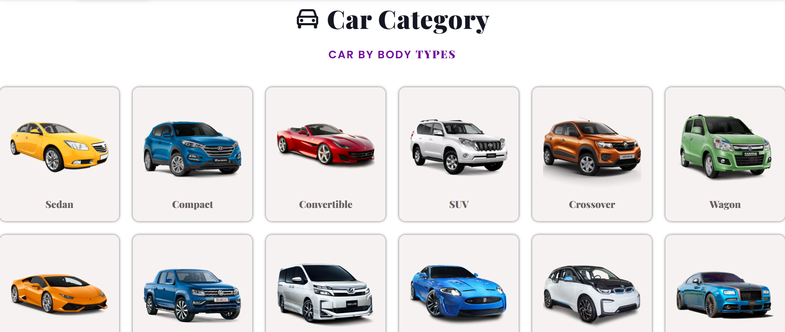
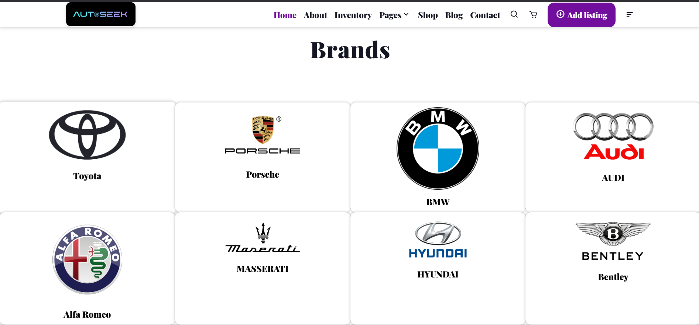
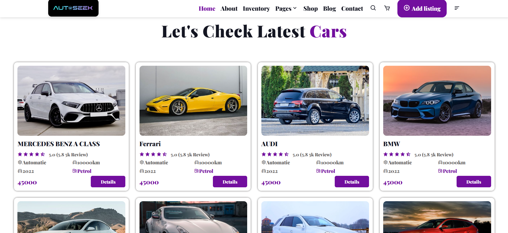
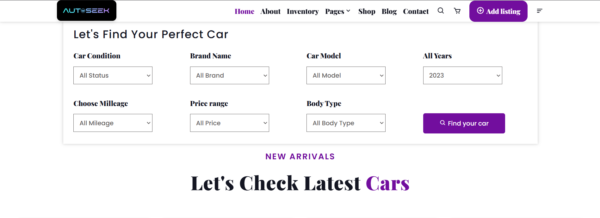

# AutoSeek - Find Your Perfect Car

## About
AutoSeek is a web application developed as part of a university project for the **"Software Engineering"** course. This is **not a finished product and serves solely as a demonstration of front-end development skills** using HTML, CSS, and JavaScript. The platform showcases a basic car search interface with features that simulate real-world functionality.

## Features
- **User-Friendly Interface** – Simple and intuitive design for an easy car-searching experience.
- **Listings** – Demonstrates how car listings could appear in a real-world application.

## Screenshots
### Homepage

### Car Categories

### Brand Categories

### Latest cars

### Filter (unfinished)

## Technologies Used
- **HTML** – Provides the structure of the web pages.
- **CSS** – Ensures styling and layout design.
- **Vanilla JavaScript** – Adds interactive functionality to the application.

## Disclaimer
AutoSeek is a prototype developed strictly for **educational purposes**. It is not intended for production use or as a fully functional car search platform.

---
Feel free to use and modify this README file as needed for your GitHub repository!

