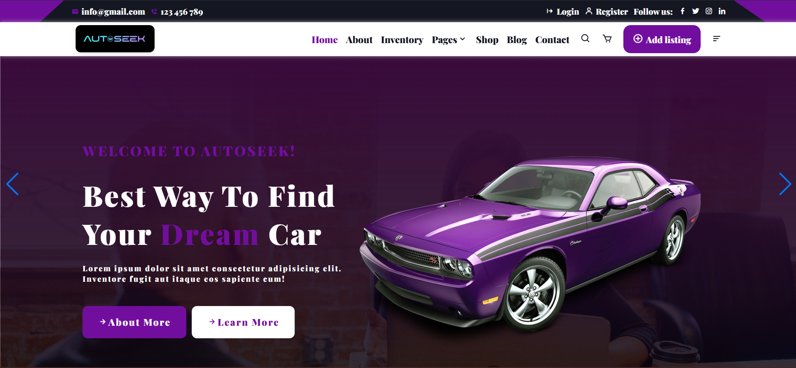

# AutoSeek - Find Your Perfect Car (University Project)

## About

AutoSeek is a web application developed as a university project for the "Software Engineering" course. The project aims to create a user-friendly car search platform, showcasing 

## Features

*   **User-Friendly Interface:** Enjoy a seamless and intuitive car-searching experience.

## Screenshots

### Homepage

### Search Filters

### Car Categories

### Listings

## Technologies Used

*  HTML, CSS and Vanilla Javascript 

